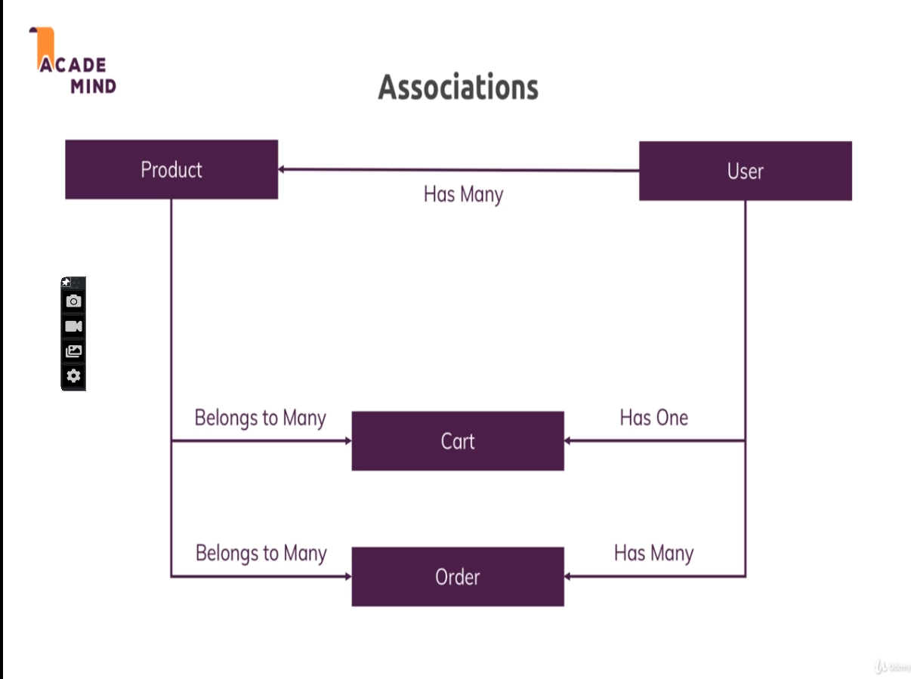

## Notes:

Sequelize can be used for different sql engines, so we have to pass dialect as mysql when configuring it. _It works with promises_  
Deleting products table we created in last module in mysql, as sequelize will manage the tables.  
By default, sequelize will log the query executed, to stop it, see https://stackoverflow.com/questions/28927836/prevent-sequelize-from-outputting-sql-to-the-console-on-execution-of-query/58521268  

16th vid onwards, all new products that are created should be associated to the currently logged (dummy) user (which we passed in the req obj in app.js)

### Relations:

The below pic contains all the relations we'll put in code  
  
**Note**: the relation `User ---has many---> Product` means here that a user can create many products (tho only admin user can create products, but rn there is no auth)  

After we created user table and made its relation with product table in app.js, a new field `userId` was added in product table (which references id in user table (foreign key)). So this happens in all relations  

_See_ req.user in app.js  

When we make a belongs to association, special methods are added by sequalize. Like we made association product belongs to user, or cart belongs to user, so we got special methods on user like createProduct() and createCart()  

when we return something in a then block which is not a promise, it is automatically wrapped in a immediate resolving promise, like this `return Promise.resolve(user);`  

cart-item table contains the cart items for each user, and is linked to both user and cart table. The rows of cart table represents a cart for each user. We can access cart-item table fields through product table too, like this in code: `product.cartItem.quantity`  

**Doubt**: for eg in getCart controller, how are we able to access products in the ejs file? we are sending products, which is an array of objects. But each object does not have attributes directly, its structure is different. like [products {dataValues: {id: 1, ...}}]. but we can access product.id directly
