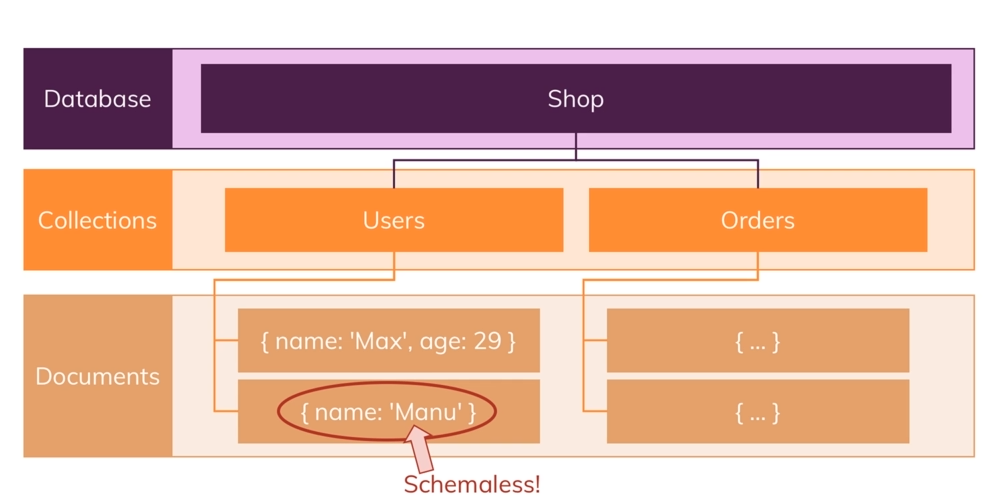

### Note: AddToCart() in user.js is a bit confusing, keep revising that!

-> In mongoDb, we have databases, collections and documents.
  

->It stores documents in JSON, or its own BSON precisely (Binary JSON, something to do with storage format and all)  

-> Using MongoDb Atlas, its a cloud version  

-> Also installed mongoDb Compass to see data(like mysql workbench)

-> the part after .net/ and before ? mark is the database name we wanna connect to in srv address.  

->We dont have to setup databases (or collection even) beforehand in mongoDb, like here we didnt create shop db anywhere still we are connecting to it. mongodb will automatically create one if it doesnt exist. we can also enter db name in client.db(); (like client.db('test')), and then it will connect to test db instead of the db name written in srv address, regardless of which db is written in srv address.  

-> \_id is actually stored in mongodb as ObjectId type (a type existing due to BSON maybe) (can see in mongodb compass) so we cant just equate ObjectId with a string (prodId in product.js)  

Note:::: remove your password  

-> in our models where we are returning the whole promise chain, in some places we 1) return the object we got in the then block (like return products), and in some cases we 2) dont attach then blocks there and just return the promise chain. Both will have same effect, as wherever that model method will be called, the then blocks chained to it will receive that object (see models). Tho we should do 1) for better catching of errors I think.. 

-> **Old**: For the 1st time, when we make a new js User obj from user data in mongodb in app.js, the user.cart passed will be null (or undefined, or with some data if we mistakenly added). When we then call addToCart in shop.js controller for 1st time, the product is then added to the empty cart and saved to the db (and logic for only adding new product, not increasing qty of old product, exists at that point)  

-> **IMP** _id attribute, when retreived, is treated as a string in JS, but is not actually string. We should use toString() method (ObjectId method).  

## Ways of relations in mongoDb in our project
### User and Product
When saving a product, we can either store a reference to a user, or embed the entire user data in the product document. If we embed all user data, then if user data changes, we need to change it in all product documents.

But we can include something which is used often and unlikely to change often, like username, together with the id.. so if we need to get more data about user, we can fetch that using id.

Or if we dont even want to change username everywhere when it changes, we can just store the id.

But in our code we dont need user data to be displayed with product data, so just storing id of user. So here no embedded doc

But we will store some user and product data in orders, so will embed docs.

`User & Products: Products has a userId reference pointing to the user's \_id attribute`

### User and Cart
One to one relation, each user needs to have a cart, in which we store products. So we'll store an embedded document of cart in user collection (so no need of cart.js (and cart-item.js)).

### Cart and Product
Cart is symbolic of that each user has one cart. cart has an items array, which contains product objects.  
In the cart-item (items) document inside user document, we will only store the productId and the quantity. Not embedding product in the cart as if the product changes, we also need to change it in cart (so ofc some extra work needs to be done to get the product details in the cart).

