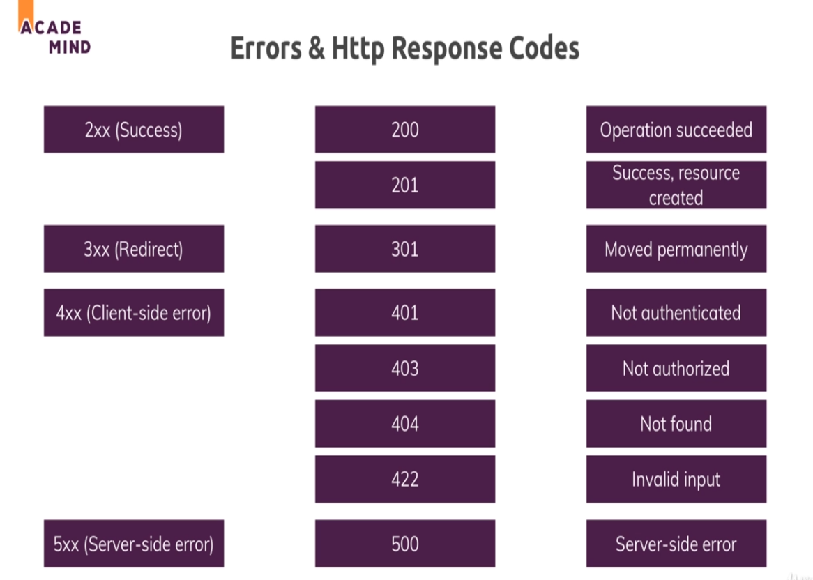

-> error-playground just for testing, see this 1st

-> The HyperText Transfer Protocol (HTTP) 500 Internal Server Error server error response code indicates that the server encountered an unexpected condition that prevented it from fulfilling the request

In case of technical errors, like when saving new product, if something fails (like mongodb), then we wanna return the 500 error page. We can redirect to '/500' (we registered its route in app.js). But we dont wanna write re.redirect('/500') in all catch blocks where any technical error can happen, so as to not increase code repetition. <br>
Then we can do like this:

```
const error = new Error(err);
//httpStatusCode is my own attribute on the error obj
error.httpStatusCode = 500;
return next(error);
```

when we call next with an error passed in arg, then express will skip all other middlewares and go directly to an error handling middleware <br>

-> nested then block's error is also handled in outside catch block!

->inside sync code, whenever we throw an error (throw new Error('sync dummy');) (not inside try catch ofc), the error handling middleware will automatically catch this error, but in async code (like in then block) we have to pass the error obj in next (like next(new Error(err));)

-> `res.redirect('/500')` in the error handling middleware can trigger infinte loops when error is thrown in sync code using throw new Error('') in any middleware above it, as then it'll loop again thru code, thats why I wrote `errorController.get500(req, res, next);`

## Status Codes:


Which status codes are available? 

MDN has a nice list: https://developer.mozilla.org/en-US/docs/Web/HTTP/Status

Or, as a short overview:

1×× Informational

100 Continue

101 Switching Protocols

102 Processing

2×× Success

200 OK

201 Created

202 Accepted

203 Non-authoritative Information

204 No Content

205 Reset Content

206 Partial Content

207 Multi-Status

208 Already Reported

226 IM Used

3×× Redirection

300 Multiple Choices

301 Moved Permanently

302 Found

303 See Other

304 Not Modified

305 Use Proxy

307 Temporary Redirect

308 Permanent Redirect

4×× Client Error

400 Bad Request

401 Unauthorized

402 Payment Required

403 Forbidden

404 Not Found

405 Method Not Allowed

406 Not Acceptable

407 Proxy Authentication Required

408 Request Timeout

409 Conflict

410 Gone

411 Length Required

412 Precondition Failed

413 Payload Too Large

414 Request-URI Too Long

415 Unsupported Media Type

416 Requested Range Not Satisfiable

417 Expectation Failed

418 I'm a teapot

421 Misdirected Request

422 Unprocessable Entity

423 Locked

424 Failed Dependency

426 Upgrade Required

428 Precondition Required

429 Too Many Requests

431 Request Header Fields Too Large

444 Connection Closed Without Response

451 Unavailable For Legal Reasons

499 Client Closed Request

5×× Server Error

500 Internal Server Error

501 Not Implemented

502 Bad Gateway

503 Service Unavailable

504 Gateway Timeout

505 HTTP Version Not Supported

506 Variant Also Negotiates

507 Insufficient Storage

508 Loop Detected

510 Not Extended

511 Network Authentication Required

599 Network Connect Timeout Error

Source: https://httpstatuses.com/