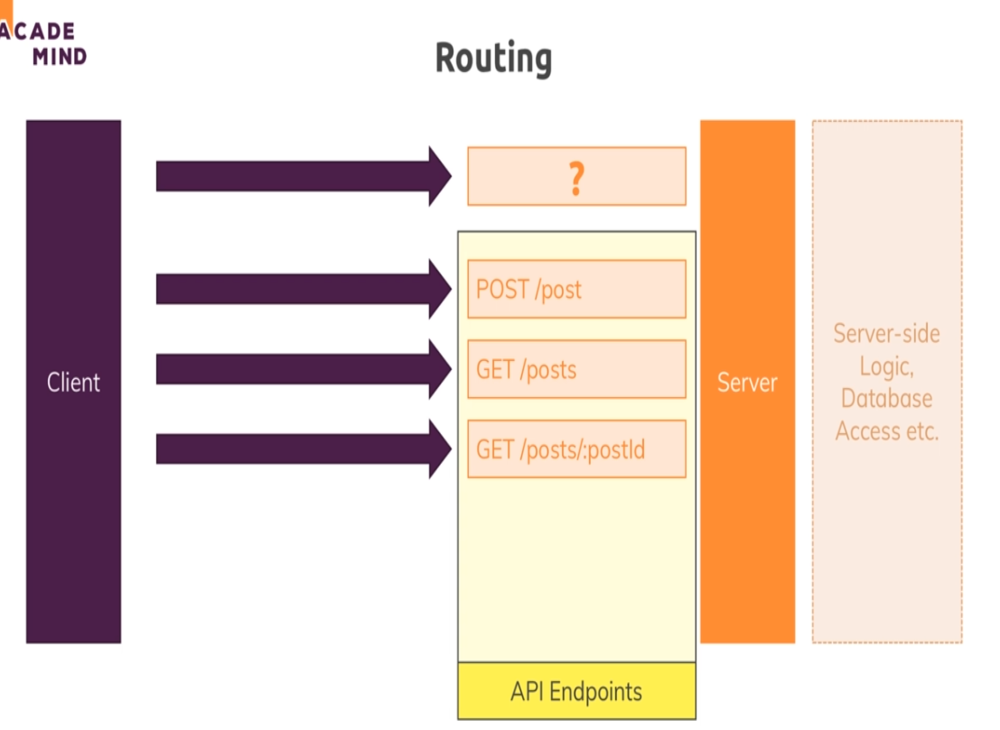
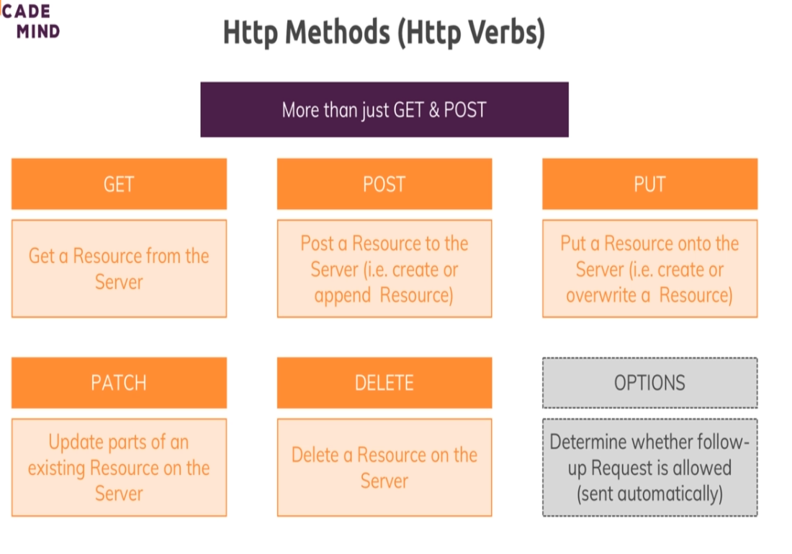
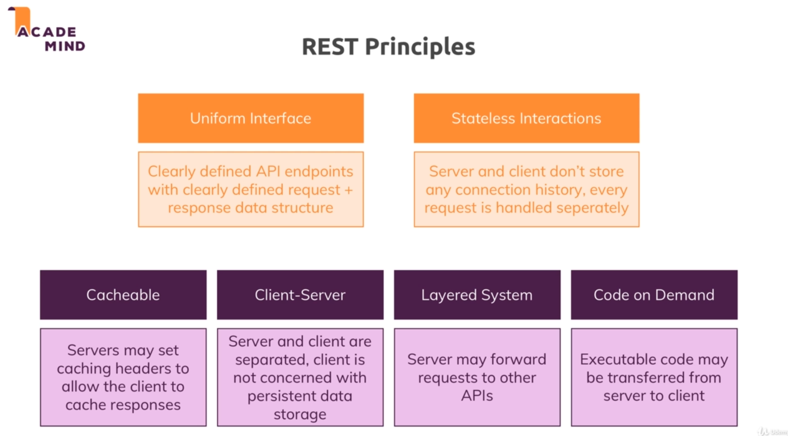

## REST (Representational State Transfer) API - basics

tho we can use any method for anything, as we have to make the logic, but its best practice to use proper http methods for tasks

We dont even have sessions here for authentication, interactions are fully stateless. 
See more about REST, see this too later: https://www.ics.uci.edu/~fielding/pubs/dissertation/rest_arch_style.htm  

### Building a blog typish api
-> using postman for sending requests (like post requests)

->When developing on localhost, and trying to access data from backend, we get a CORS (cross origin request sharing) error. cors is blocked by default by browsers. It means, if client and server run on same domain (like localhost:8000), we can send req and res without issues (like in earlier project, the html files were rendered on the server, and so were served by the same server as we sent our requests to). But if they run on different domains, it will result in cors error. for eg. in vid he ran html and js code on codepen and sent req, which would be running on a different server, so error was sent. OR like Google maps, we are not running our app on their server. OR like when using making react app..

CORS (see more later) is diabled by default for security so as to not exchange data thru different domains, but we want in a rest api to exchange data. We can only solve this on the server side code. (see app.js)

-> When using codepen as in vid, we see that when sending a post request, actually 2 requests are sent. The first req is one sent by browser automatically with method OPTIONS, it checks if the request we plan to send will be allowed, otherwise it'll throw error. (**IMP** the browser was able to send OPTIONS request even tho we didnt set OPTIONS to be allowed in Access-Control-Allow-Methods)