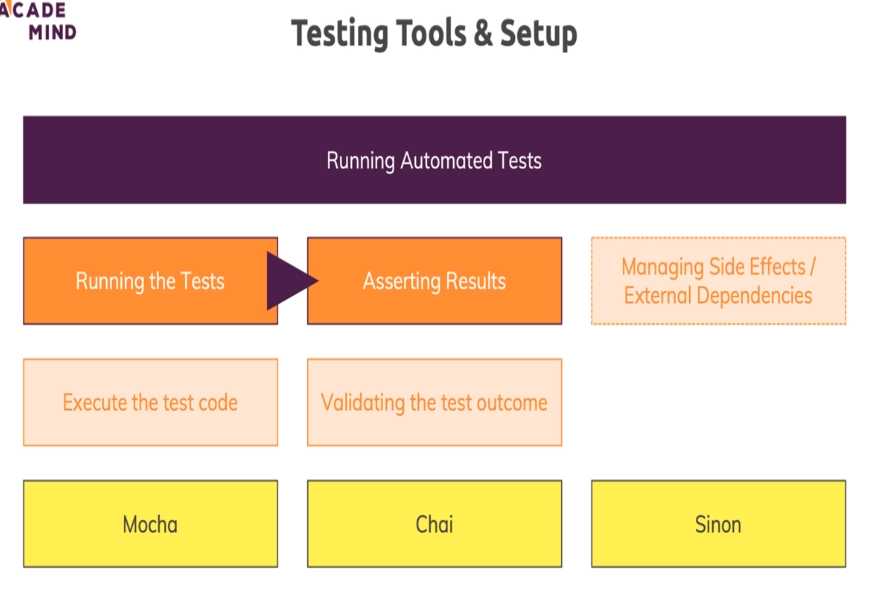

Taken from code given by max in 30th module, as it has async await syntax everywhere (and made some relevant changes as well).

--in package.json, rewrited the test script (as mocha). Now when we run npm test, it'll run all tests we defined. (if no test file made, err will be shown).

--mocha looks for a folder named test.